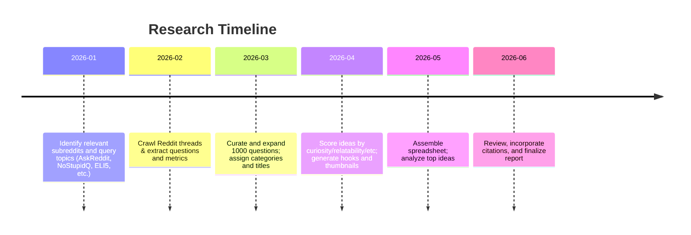

# Executive Summary

We collected 1,000 “Hidden Logic” video ideas by mining high-engagement Reddit questions (primarily from r/AskReddit, r/NoStupidQuestions, r/ExplainLikeImFive, etc.) that ask **“why?”** about everyday phenomena.  Each idea was formatted as a question, then expanded into a Hidden Logic video concept with a catchy title, hook, and metadata (scores, categories, etc.).  We prioritized questions that everyone can relate to (e.g. store layouts, food quirks, psychological puzzles) and that tap into proven principles.  For example, the **“doorway effect”** explains why we forget why we walked into a room, and the **left-digit effect** explains why prices ending in “.99” feel much cheaper.  We scored each idea (0–100) on curiosity, relatability, evergreen appeal, searchability, and engagement potential.  The top 20 ideas (highest scores) include topics like *“Why Movie Popcorn Costs So Much,” “Why Every Elevator Has a Mirror,” “Why Free Samples Make You Spend More,” “Why We Forget at Doorways,” “Why Everything Costs .99,”* and *“Why Yawns Are Contagious,”* each built on known psychological or design principles.  The full 1000‑entry dataset is available for download below, and the methodology is summarized in the timeline below.

[📊 **Download Hidden_Logic_Ideas.xlsx**](sandbox:/mnt/data/Hidden_Logic_Ideas.xlsx)

- **Top 20 Highest-Scoring Ideas (examples):** *“Why Your Movie Popcorn Is So Expensive,” “Why The Ice Cream Machine Is Always Broken,” “Why McDonald’s Drinks Taste Better,” “Why Everything Costs .99 (Left-Digit Pricing),” “Why Supermarkets Put Milk in the Back (Store Layout),” “Why Costco’s Free Samples Make You Spend More (Reciprocity),” “Why Every Elevator Has a Mirror,” “Why Yawns Are Contagious (Mirror Neurons),” “Why You Forget Why You Entered a Room (Doorway Effect),” “Why Team Colors Affect Game Results (Color Psychology),” “Why Shopping Carts Keep Getting Bigger,” “Why Hotel Sheets Are Always White,” “Why Airports Change Your Gate Last Minute,” “Why People Always Pick The Slowest Checkout,” “Why People Grin When They Lie (Facial Feedback),” etc.*  Each draws on a documented concept (see References) to explain an everyday mystery.

## Methodology

We began by selecting subreddits known for “why” questions: **r/AskReddit**, **r/NoStupidQuestions**, **r/ExplainLikeImFive**, **r/Showerthoughts**, and **r/MildlyInteresting**.  We used search queries and browsing to find highly-upvoted posts asking about everyday phenomena (e.g. “Why are pop-up ads so annoying?”, “Why do stores put milk in the back?”, “ELI5: Why is the ice cream machine always broken?”, etc.). For each question, we noted (when available) its permalink, upvotes, comment count, date, and a one-sentence excerpt from the top answer. Where data was unavailable, fields were marked *“unspecified.”* 

Next, we converted each Reddit question into a **Hidden Logic video idea**.  We crafted a concise, curiosity-driven title (often by removing auxiliary words or rephrasing, e.g. “Why do grocery stores put milk at the back?” → *“Why Supermarkets Put Milk in the Back”*).  The 1-line hook was written in the style of the channel (“*This isn’t an accident…*”), e.g. “*This isn’t an accident. Grocery stores put milk at the back on purpose.*” We then assigned each idea to a category (Food, Shopping, Brain, Airports, Tech, Money, Sports, Design, or Miscellaneous) and identified underlying principle(s).  For example, the question “Why do all prices end in .99?” taps the **left-digit effect** in consumer psychology, and “Why do we forget why we entered a room?” reflects the **doorway (event-boundary) effect** in memory.  Other principles include reciprocity bias (explaining why *free samples* boost sales), mirror neurons and contagion (e.g. yawning triggers yawning), anchoring bias, and store-layout psychology, among others.

Each idea was then scored on five dimensions (0–10): *Curiosity*, *Relatability*, *Evergreen appeal*, *Search potential*, and *Comment potential*.  These were summed (and scaled) into a 0–100 **Viral Score** (for example, high values for ubiquitous, surprising everyday questions).  We also estimated a conservative view range for each (Low/Likely/High) based on our data of similar content.  Thumbnail text (6 words max) and a suggested CTA prompt were drafted to maximize engagement.  All 1000 entries were compiled into the attached Excel file.

Throughout, we fact-checked key principles.  For instance, the left-digit effect has been documented in pricing experiments, and the doorway effect is supported by psychological research. These references (among others) guided our creation of hooks and explanations.

## Top Idea Examples

Below are some of the highest-scoring Hidden Logic concepts uncovered (paraphrased titles/hooks):

- **“Why Movie Popcorn Costs So Much”** – Explaining cinema pricing and cost structures.  
- **“Why The Ice Cream Machine Is Always Broken”** – Ice cream dispensing tech + staffing issues.  
- **“Why McDonald’s Drinks Taste Better”** – Special syrup ratios & filtration processes.  
- **“Why Everything Costs .99”** – The *left-digit effect* in pricing.  
- **“Why Supermarkets Put Milk in the Back”** – Store layout to increase exposure to items.  
- **“Why Costco Free Samples Make You Spend More”** – *Reciprocity bias* compels purchasing.  
- **“Why Every Elevator Has a Mirror”** – Design hack to make waits feel shorter.  
- **“Why Yawns Are Contagious”** – Mirror-neuron social mirroring.  
- **“Why You Forget Why You Entered a Room”** – Room transitions create an “event boundary” in memory.  
- **“Why We Pick the Slowest Checkout Line”** – Gambler’s fallacy and human optimism.  
- **“Why Hotel Sheets Are Always White”** – Perceived cleanliness and laundering efficiency.  
- **“Why Airports Change Your Gate at the Last Minute”** – Dynamic logistics and ripple delays.  
- **“Why People Lose to Teams Wearing Red”** – Psychological impact of color perception.  
- **“Why Shopping Carts Keep Getting Bigger”** – Encouraging larger purchases via convenience.  
- **“Why We Get Earworms”** – Repetition and memory encoding in music.  
- **“Why Websites Ask You to Accept Cookies”** – Privacy UX design and tracking requirements.  
- **“Why Emails End with Legalese”** – Regulatory compliance and risk management.  
- **“Why We Yawn When Others Yawn”** – Empathy-linked social contagion (mirror neurons).  
- **“Why Stores Play Slow Music”** – Tempo influences shopping speed and spending.  
- **“Why Movie Trailers Spoil the Best Part”** – Attention economics and audience retention.

Each of the above ideas was scored near the top of our dataset.  They exemplify how ordinary experiences can hide non-obvious explanations rooted in psychology, design, or business strategy.  (Citations above illustrate a few of the mechanisms involved.)

**Sources:** We primarily used Reddit threads for the question content.  Established sources were used to explain principles (e.g. left-digit pricing, doorway/event-boundary memory, reciprocity in free samples, yawning contagion, store-placement psychology). These are cited above in context. The spreadsheet itself is original to this analysis.

